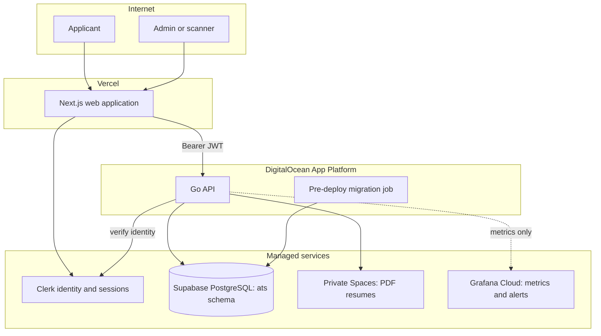
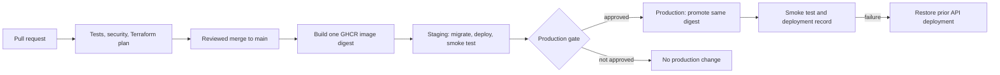
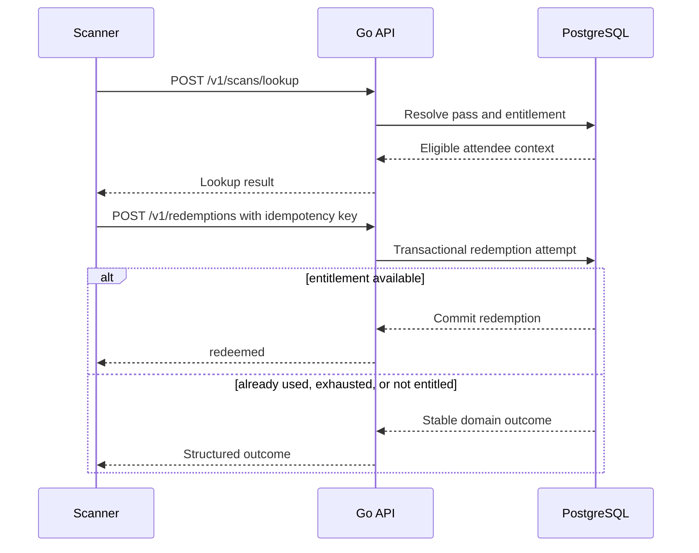

# Architecture

This is the public technical overview. Detailed product language, security invariants, deployment settings, and runbooks live in [`docs/`](docs/README.md).

## Design principles

1. The Go API is the sole authority for authorization, lifecycle state, and database access.
2. Clerk proves identity; PostgreSQL-backed roles determine HackAtlantic access.
3. PostgreSQL constraints and transactions protect pass and redemption invariants under retries and concurrent scanners.
4. PII and bearer credentials never belong in browser telemetry, dashboards, or logs.
5. Staging is synthetic-only; the exact image digest tested there is promoted to production.

## Runtime containers and trust boundaries

The browser never receives database, Spaces, or migration credentials. Clerk does not store application answers, roles, decisions, pass state, or redemption state. Grafana receives low-cardinality operational data only once the API exporter is configured.

## Release path

The rollback restores application code/configuration, not a database migration. Schema changes are forward-only and must remain compatible through the release.

## Scanner redemption sequence

The redemption transaction—not the scanner UI—decides whether a redemption can occur. This is why concurrent requests cannot create an over-redemption.

## Source of truth

| Concern | Authority |
| --- | --- |
| Identity and sessions | Clerk |
| Roles, applications, decisions, passes, redemptions | Go API plus PostgreSQL |
| Database schema | Forward-only Go migrations in `api/migrations/` |
| Infrastructure | Terraform with separate HCP Terraform state per root |
| Public API contract | `openapi/openapi.yaml` |
| Operational evidence | `docs/evidence/` and workflow artifacts |

For package boundaries and the complete data model, continue to [docs/ARCHITECTURE.md](docs/ARCHITECTURE.md) and [docs/DOMAIN_MODEL.md](docs/DOMAIN_MODEL.md).
