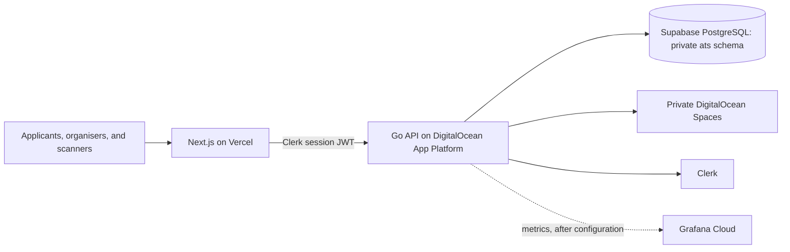

# HackAtlantic ATS

HackAtlantic ATS is the application, review, attendee-pass, and event-operations system for HackAtlantic. It is deliberately a small PaaS deployment: a Next.js web app, a Go API, managed PostgreSQL, private object storage, and a digest-pinned release pipeline. The API—not the browser—owns every authorization decision and all durable event state.

## What it does

- Lets applicants save and submit a versioned HackAtlantic application.
- Gives organizers private review, decision, attendee, pass, and event controls.
- Lets authorised staff scan QR passes and redeem checkpoint entitlements atomically.
- Keeps résumés private and serves them only through the authorised API.

## Architecture at a glance



See [ARCHITECTURE.md](ARCHITECTURE.md) for runtime boundaries, deployment, and the atomic redemption sequence. See [docs/README.md](docs/README.md) for the complete operator and implementation guide.

## Repository map

| Path | Purpose |
| --- | --- |
| `app/`, `components/`, `lib/` | Next.js applicant, organiser, pass, and scanner UI |
| `api/` | Go HTTP API, domain services, SQL, and forward-only migrations |
| `openapi/` | Implemented HTTP contract |
| `infra/` | Isolated Terraform roots and reusable platform module |
| `observability/` | Versioned Grafana dashboard definitions |
| `tests/load/` | Staging-only k6 profiles and synthetic fixtures |
| `docs/` | Design, security, deployment, operations, and evidence records |

## Run locally

Prerequisites: Node.js, Go, Docker Desktop, and a local `.env` based on `.env.example` plus `api/.env.example`. Never copy production secrets locally.

```bash
npm install
docker compose up -d
npm run api:migrate
npm run api:seed-intake
npm run api:dev
# In another terminal:
npm run dev
```

Useful verification commands:

```bash
npm run lint
npm run build
npm run api:test
npm run test:components
```

On Windows machines with Avast HTTPS inspection, use `npm run dev:windows` for the frontend rather than disabling TLS verification.

## Environments and delivery

Pull requests run application, migration, security, container, and Terraform checks. A merge to `main` builds one immutable API image, tests that exact digest in staging, then requires the protected production deployment gate before the same digest is promoted. Database migrations are forward-only.

Staging uses synthetic data. Production applicant data is never copied to staging. Current operational details are in [docs/DEPLOYMENT.md](docs/DEPLOYMENT.md), [docs/runbooks/release.md](docs/runbooks/release.md), and [docs/runbooks/load-test.md](docs/runbooks/load-test.md).

## Contributing and conduct

Read [CONTRIBUTING.md](CONTRIBUTING.md) before opening a pull request and [CODE_OF_CONDUCT.md](CODE_OF_CONDUCT.md) for community expectations. Security issues belong in [docs/SECURITY.md](docs/SECURITY.md), not public issue threads.

## Honest project status

The core ATS lifecycle, role model, QR redemption, staging k6 workflows, Terraform roots, and release pipeline are implemented. Grafana dashboard and alert configuration is provisioned, while live API metric ingestion is being connected; do not treat empty panels as evidence of availability. See [docs/evidence/measurements.md](docs/evidence/measurements.md) for which k6 and recovery numbers are valid for public claims.
