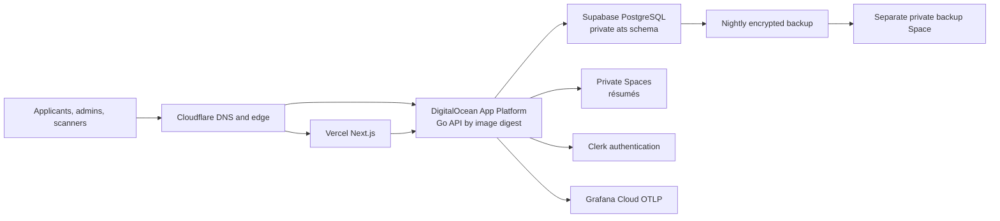
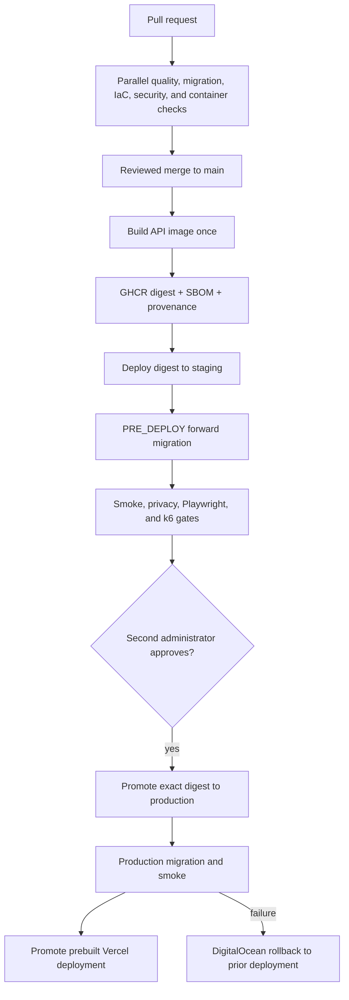

# Production platform engineering

The platform preserves the product’s PaaS architecture while adding reproducible infrastructure, immutable delivery, supply-chain evidence, telemetry, and tested recovery. Kubernetes is intentionally absent: this workload does not need an orchestrator to demonstrate reliable operations.

## Runtime architecture

Staging and production have separate databases, storage, Clerk instances, API applications, and frontend configuration. Production data is never copied to staging.

## Release architecture

Database changes use expand/contract compatibility. Application rollback is automatic; schema rollback is never automatic.

## Supply-chain controls

- Every release image is digest-pinned in DigitalOcean.
- Buildx emits provenance and an image SBOM; a separate SPDX JSON SBOM is retained as an artifact.
- GitHub verifies the attestation before staging.
- Trivy blocks critical/high container and IaC vulnerabilities.
- CodeQL and dependency review cover application changes.
- Every third-party action is pinned to a complete commit SHA.
- Workflows use explicit minimal permissions and deployment environments.
- Forked pull requests never execute Terraform plans that require protected credentials.
- Same-repository Terraform plans require a separate `terraform-plan` environment approval and cannot access deployment credentials.
- Rego rejects public storage, floating images, plaintext secret configuration, missing readiness checks, and protected-resource deletion.

## Telemetry and privacy

The API exports low-cardinality route-template metrics, traces, database-pool health, and lifecycle event counts. `X-Request-ID` is returned on every instrumented response and included in structured logs. `/versionz` exposes only version, Git SHA, build timestamp, and environment.

Telemetry must never contain applicant names, emails, schools, résumé identifiers, answers, JWTs, QR credentials, or claim URLs. Claim routes are excluded from automatic HTTP tracing to prevent path-borne bearer material from becoming a span attribute.

## Threat model

| Threat | Primary control | Verification |
| --- | --- | --- |
| Applicant reaches organizer/reviewer data | PostgreSQL-backed roles plus API authorization | Go integration tests and Playwright least-privilege journeys |
| QR/claim credential leaks into logs or traces | Hashed credential design, route templates, claim trace exclusion | Privacy tests and log review |
| Résumé or backup becomes public | Private bucket ACL, policy-as-code, `prevent_destroy` | Terraform plan + Conftest |
| Compromised dependency reaches production | CodeQL, dependency review, Trivy, SBOM, provenance | Required PR/release checks |
| Deployment rebuild differs between environments | GHCR digest promotion | `/versionz` SHA and attestation verification |
| Migration breaks production | Fresh/upgrade tests and PRE_DEPLOY job | Staging release gate |
| Failed release remains active | Smoke gate and prior-deployment rollback | Deliberately broken staging exercise |
| Operator destroys production resource | Separate workspaces, protected environment, `prevent_destroy` | No-replacement production plan |
| Database loss or corruption | Encrypted retained backups and approved restore drills | Monthly RTO report |
| DNS cutover interrupts web or email | Full inventory/parity checks and staged DNSSEC | Before/after probes and mail verification |

## Evidence

Keep redacted screenshots and generated reports under `docs/evidence/`. Never commit secrets, applicant records, bearer values, full provider IDs, or raw production logs. The evidence checklist is in `docs/PORTFOLIO_EVIDENCE.md`.
