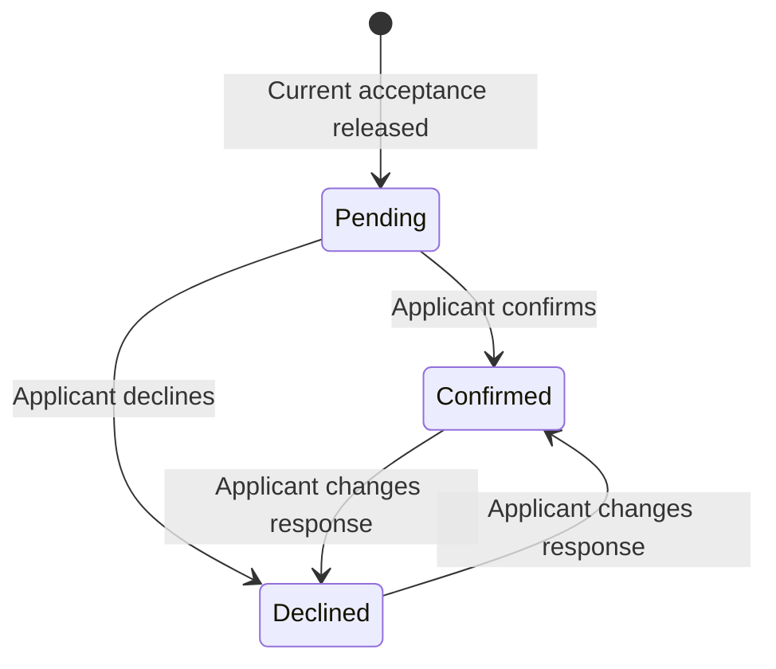

# Product lifecycle

This repository implements the complete HackAtlantic application tracking
system and its downstream event operations.

## Primary lifecycle

```text
Clerk account
  -> application draft
  -> submitted application snapshot
  -> admin review workflow
  -> accepted | waitlisted | rejected
  -> accepted application becomes attendee
  -> acceptance released and applicant confirms RSVP
  -> admin releases attendee pass a few days before the event
  -> event and meal redemptions
```

There is no external application tracking system and no attendee import
boundary. PostgreSQL is authoritative from the first saved draft through the
last event redemption.

## Actors

### Applicant

- Creates and authenticates with a Clerk account.
- Creates one application for the active application cycle.
- Saves draft answers over multiple sessions.
- Submits before the configured deadline.
- Sees submission state and released decisions.
- Uses the same account to view an attendee pass after acceptance.
- Confirms or declines attendance after the current acceptance is released.

### Admin

- Authenticates with Clerk.
- Receives admin only when Clerk's verified primary email is in PostgreSQL's
  admin email allowlist.
- Configures the application cycle and published form definition.
- Searches, filters, and reviews submitted applications.
- Records structured scores, recommendations, and internal notes.
- Reviews applications and records/releases decisions.
- Manages attendees, passes, checkpoints, entitlements, and staff access.
- Can use the QR scanner and redemption workflow.

### Scanner

- Authenticates with Clerk.
- Resolves and redeems attendee passes at authorized checkpoints.
- Cannot access application answers or reviewer notes.

## Application state

Initial states:

```text
draft
submitted
withdrawn
accepted
waitlisted
rejected
```

Rules:

- Only `draft` can be edited by the applicant.
- Submission validates the complete form and records `submitted_at`.
- Submitted answers are stable for review. Reopening requires an explicit
  organizer action and audit event.
- Decisions are internal until explicitly released.
- Applicants see only released decisions.
- Acceptance creates exactly one attendee for the application.
- Waitlisting and rejection do not create attendees.
- A released decision is changed only by a new audited decision action, never
  by silently overwriting history.

The implementation may introduce an internal `under_review` workflow state,
but it must not be required merely to assign or review an application.

## Form lifecycle

The initial product does not need a drag-and-drop form builder. A reviewed form
schema can be seeded or managed through organizer tooling.

Every application references an immutable published form version. Draft and
submission validation use that version so later form edits cannot reinterpret
historic answers.

Question keys remain stable within a form lineage. Answers are stored by
application and question key using typed JSON values.

## Review lifecycle

```text
submitted application
  -> draft review
  -> submitted review
  -> admin decision
  -> decision release
```

Reviewer notes and scores are internal. They must never be included in
applicant responses, emails, exports intended for applicants, or scanner APIs.

## Acceptance transaction

Recording an acceptance must atomically:

1. create a decision-history record;
2. update the application's current decision state;
3. create or resolve exactly one attendee linked to the application and user;
4. write an audit event.

Releasing that decision is a separate atomic action that:

1. marks the current decision and application as released;
2. enqueues the appropriate decision email in the transactional outbox;
3. writes an audit event.

Pass issuance is a later, explicit admin operation after the applicant confirms
their RSVP, normally a few days before the event. Recording or releasing an
acceptance must not issue a pass. Retries must not create duplicate attendees or
passes.

## Attendance RSVP

RSVP measures attendance intention, not admission or actual arrival. The applicant
dashboard offers **Confirm attendance** and **I can't attend** only after the
current acceptance is released. Applicants can change their response; declining
requires a confirmation step. Existing released acceptances start as pending.

Admins see confirmed, awaiting-RSVP, and not-attending counts in the application
queue, can filter by response, and can inspect the response timestamp in detail.
Counts describe the displayed results, not all cycles or scanned attendees.

The intended operational sequence is **acceptance released → RSVP confirmed →
admin releases the pass a few days before the event → attendee checks in**.
Confirmation never issues a pass or queues a pass email automatically. Admins
choose when to use the existing per-attendee **Issue pass** action; there is no
scheduled or bulk release job in this version. The pass-link email is queued only
by that explicit issuance action.



Persistence and safety:

- `ats.attendance_responses` stores one response per decision; no row means
  pending. An acceptance replacement begins pending, retaining older history.
- Only the owning applicant can write. Unreleased decisions, other applicants,
  and non-accepted applications return 404; scanner-only access returns 403.
- Writes take the same application-row lock as decision recording, then re-read
  eligibility and response state. A changed admission cannot race past RSVP.
- `decisionId` plus `lockVersion` protects stale tabs. Repeating the current
  choice is idempotent; an opposing stale choice returns 409. Actual changes and
  `attendance.rsvp_changed` audit events commit in one transaction.
- The Supabase Data API roles receive no table access. The runtime role can
  read/insert/update responses but cannot delete them.
- Pass issue and reissue require a confirmed RSVP for the current released
  acceptance. A pending/declined response returns `409 rsvp_required`. The check
  occurs after acquiring the application lock, preventing a concurrent decline
  from being ignored by a waiting issuer. The admin controls also disable release
  until confirmation; the backend is authoritative if the admin page is stale.

This first version does **not** add deadlines, reminder emails, automatic waitlist
promotion, automatic pass revocation, or a new RSVP check inside scanning. An RSVP
does not guarantee someone will show up; the redemption ledger remains the record
of actual check-in. Any capacity-release policy requires a separate product decision.
Already-issued passes are not silently invalidated when someone changes their RSVP;
admins retain the existing explicit revoke action, even for a declined RSVP.

Deployment requires migration `000014_attendee_rsvp.sql` before the new API, then
the frontend. The migration is additive; rolling back application code leaves
responses intact. Do not edit an already-applied migration or drop the table to
roll back code. Before promotion, run component/API tests and the disposable
database integration suite, including `TestRSVPLifecycleAuthorizationConcurrencyAndDecisionChanges`.

## Email lifecycle

Email is a delivery channel, not the source of truth. PostgreSQL records:

- which template/event should be sent;
- recipient and non-secret template data;
- attempt count and delivery state;
- provider message identifier;
- timestamps and safe error summaries.

Submission confirmation and released decision actions enqueue email within the
same database transaction as the state change. A worker sends queued messages
and records provider results. Provider outages must not roll back an already
committed application or decision.

## Pass independence

An accepted applicant can view their pass while authenticated. Email may also
contain a revocable pass link. The QR credential itself resolves a pass without
a Clerk session so Apple Wallet, Google Wallet, and the scanner continue to
work independently after issuance.
